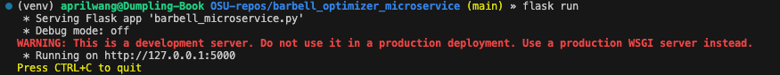
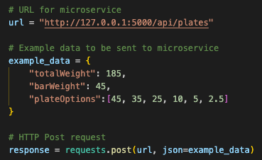
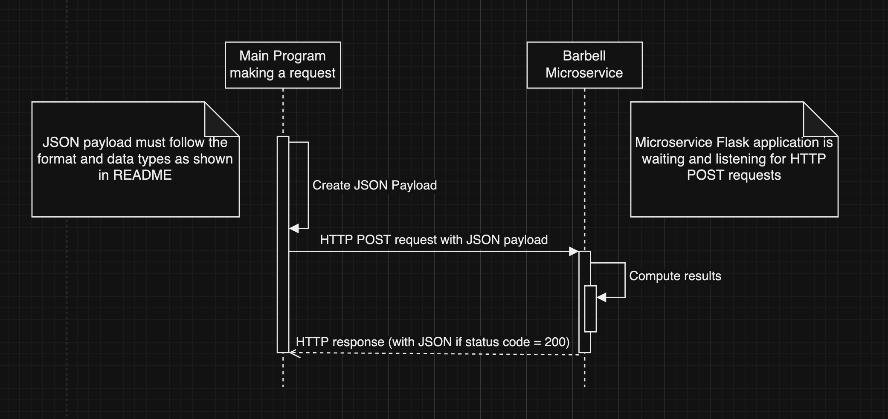

# Barbell Microservice
For Oregon State University's CS 361 Software Engineering I class

Given a JSON payload containing totalWeight, barWeight, and plateOptions, returns a JSON object containing the plates required per side in pounds. It also returns the information in units of kilograms and also returns the equivalent weight of the totalWeight in various fun units (corgis, cats, kegs, gold bars).

# General Flask User Notes:
Assumes Mac. For Windows/Powershell, most of the instructions can be found [here](https://blog.miguelgrinberg.com/post/the-flask-mega-tutorial-part-i-hello-world).
1. Install python
2. (First time only)   
Create a virtual environment  
    ```bash
    $ python3 -m venv venv
    ```
3. (Every time you want to run Flask)   
Activate virtual environment
    ```bash
    $ source venv/bin/activate
    ```
4. (First time only)  
Install Flask (make sure you're in venv!)
    ```bash
    (venv) $ pip install flask
    ```
5. To run Flask application:
    ```bash
    (venv) $ export FLASK_APP=microblog.py
    (venv) $ flask run
    ```
    
6. You can click the link shown in the "Running on [...]" message (nothing will show up until you add /api/plates to the end of the url though)
7. To terminate Flask application, follow instructions in terminal on how to quit.


# Communication Contract
## Instructions how to REQUEST data
1. Run the provided Flask application (see the app folder) locally (see General Flask User Notes above). This listens for incoming requests on the microservice endpoint (/api/plates).
2. Make a HTTP POST request to the endpoint (see Example Call below) with the JSON payload. Be sure to pass in the correct url and data.

See Example Call for the JSON payload structure this microservice expects.

### Example Call 


## Instructions how to RECEIVE data
1. Store the response and parse it to JSON (see example call for a Python example).
2. Check the response's status code to ensure that it is successful (and handle if the status code indicates it's been unsuccessful)
3. You can use bracket notation to access the JSON data (see example call for Python example).

```python
# Example of JSON object in response
{'lbs': {
    "platesPerSide": {'25': 1, '45': 1},
    "totalWeight": 185,
    "barWeight": 45,
    "platesWeight": 140},
'kgs': {
    "platesPerSide": {'11.3': 1, '20.4': 1},
    "totalWeight": 83.8,
    "barWeight": 20.4,
    "platesWeight": 63.4},
'funUnits': {
    'corgis': 6.9,
    'cats': 18.5,
    'full kegs': 1.2,
    'gold bars': 6.8}
}
```

### Example Call
```python
results = response.json()

# To demonstrate how to access the results data: 
print(results['lbs'])
print(results['kgs'])
print(results['funUnits'])
print(results['funUnits']['corgis'])
```

# UML Diagram
